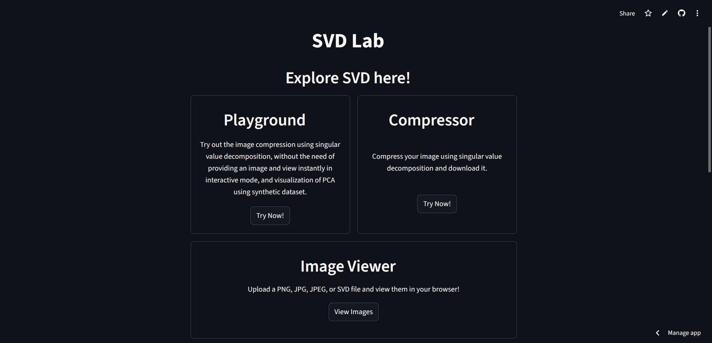
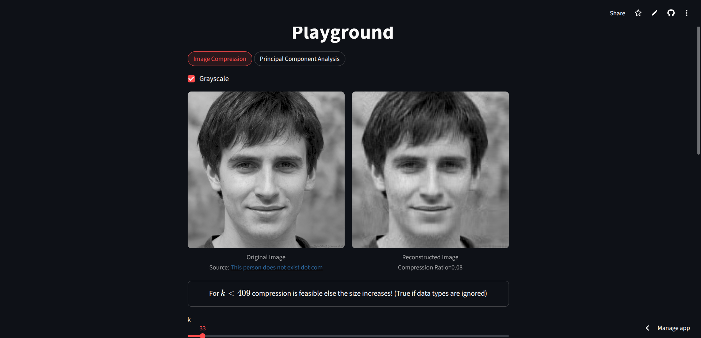
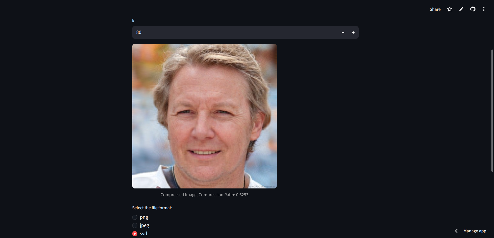
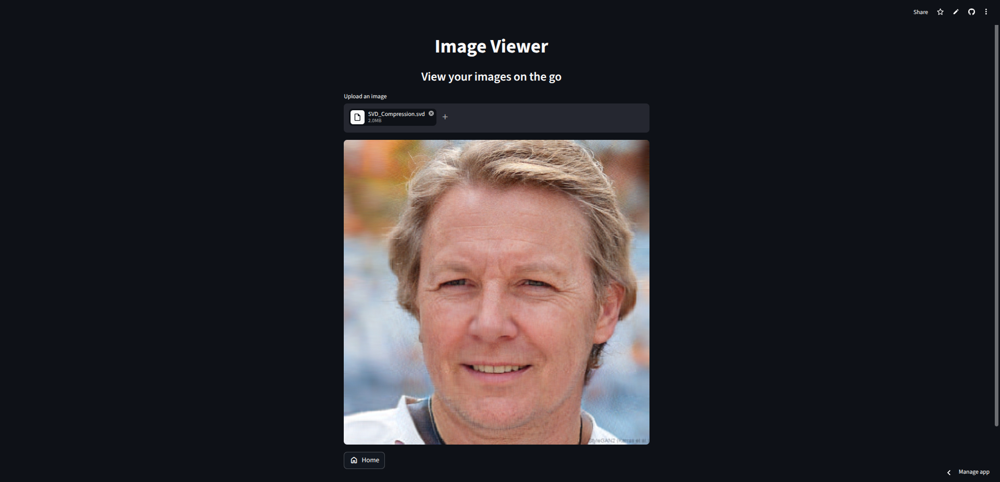
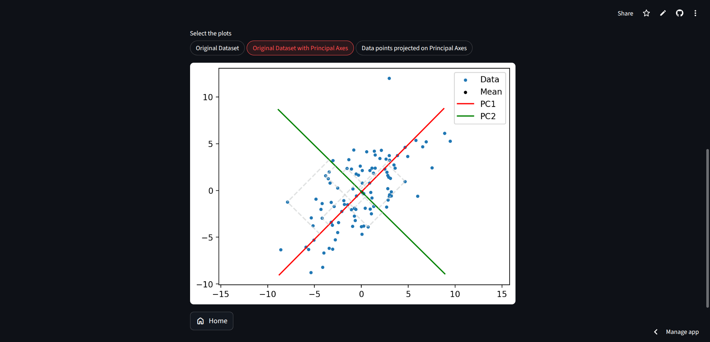
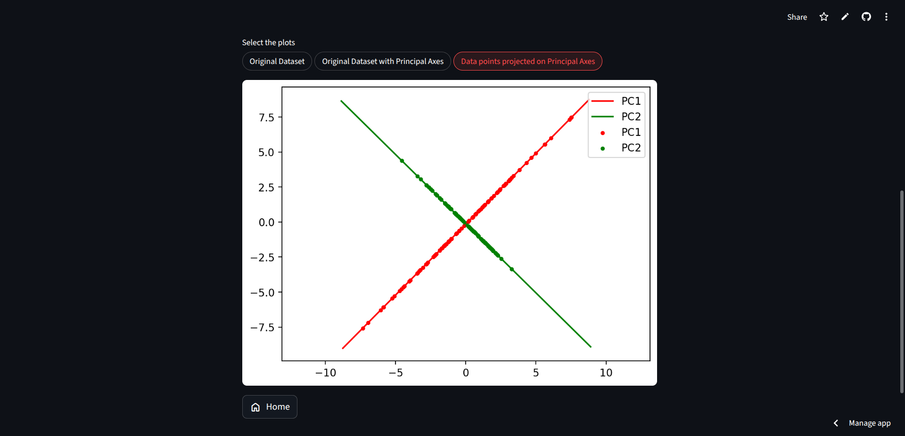
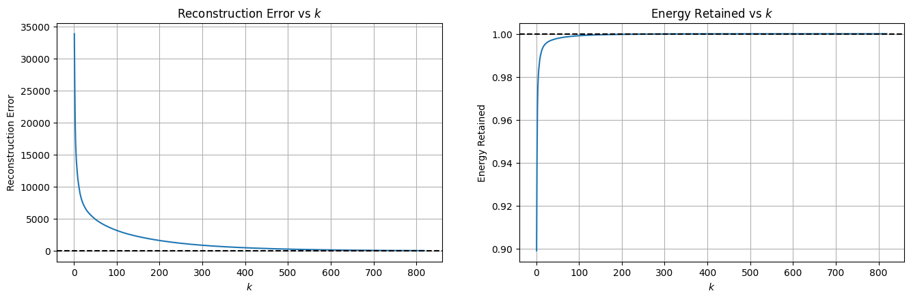
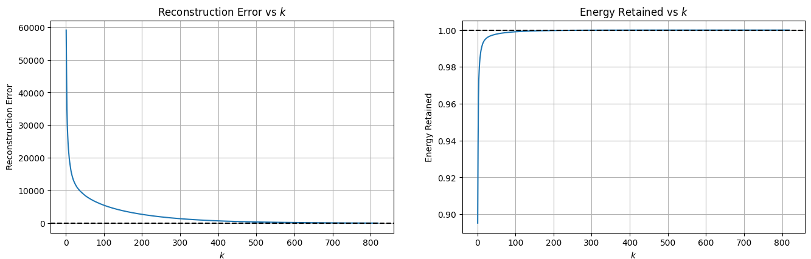
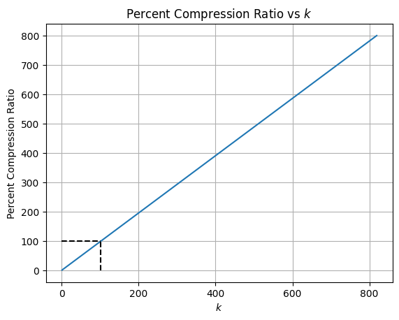

# Singular Value Decomposition

This repository demonstrates Singular Value Decomposition (SVD) applied to image compression and Principal Component Analysis (PCA). It includes both a from-scratch SVD implementation and an optimized NumPy-based method, plus utilities to compress images, perform PCA, and evaluate reconstruction quality.

## Results:
### [SVD Lab](https://svdlab.streamlit.app)


Landing page.



Image Compression Playground.



Compressor.

Above image is sourced from [This person does not exist dot com](https://thispersondoesnotexist.com).
Compressed image is saved in custom binary format (`.svd`)



Image Viewer. Viewing the compressed `.svd` image.



PCA Playground.



PCA Playground.

### Plots:
The below plots are for the [test image](data/image.png)



"Reconstruction Error vs $k$" and "Energy Retained vs $k$" plots for grayscale images.



"Reconstruction Error vs $k$" and "Energy Retained vs $k$" plots for color images.



The above plot takes disk space needed for `np.float32` datatype into account. At $k=102$, a 100% compression ratio is achieved, i.e., the size of processed image is equal to size of original image; increasing $k$ would increase the size of processed image.


## Project Overview

- `mathematical_foundation/svd_from_scratch.py`: Implements SVD using linear algebra fundamentals and eigen-decomposition.
- `optimized_method/optimized_svd.py`: Uses NumPy's optimized SVD routines to compute singular values and reconstruct compressed matrices.
- `application/image_compression.py`: Provides image compression helpers, including support for grayscale and color images.
- `application/principal_component_analysis.py`: Implements Principal Component Analysis (PCA) utilizing SVD.
- `svd_encoder/svd.py`: Implements the custom binary `.svd` file format encoder and decoder.
- `metrics/metrics.py`: Contains reconstruction error and compression ratio utilities.
- `analysis/understanding_svd_with_image_compression.ipynb`: A notebook for exploring SVD concepts and image compression behavior.
- `analysis/pca_using_svd.ipynb`: A notebook demonstrating SVD application to Principal Component Analysis (PCA).<br>
More detailed READMEs are provided in each directory.

## Repository Structure
Project directory structure (excluding paths ignored by `.gitignore`):

```
.
├── .python-version
├── analysis/
│   ├── README.md
│   ├── pca_using_svd.ipynb
│   └── understanding_svd_with_image_compression.ipynb
├── application/
│   ├── README.md
│   ├── __init__.py
│   ├── image_compression.py
│   └── principal_component_analysis.py
├── data/
│   └── image.png
├── mathematical_foundation/
│   ├── README.md
│   ├── __init__.py
│   └── svd_from_scratch.py
├── metrics/
│   ├── README.md
│   ├── __init__.py
│   └── metrics.py
├── optimized_method/
│   ├── README.md
│   ├── __init__.py
│   └── optimized_svd.py
├── svd_encoder/
│   ├── README.md
│   ├── __init__.py
│   └── svd.py
├── web_app/
│   ├── README.md
│   ├── .streamlit/
│   │   └── config.toml
│   ├── assets/
│   │   ├── color.npz
│   │   └── grayscale.npz
│   ├── landing_page.py
│   └── pages/
│       ├── compressor.py
│       ├── image_viewer.py
│       └── playground.py
├── LICENSE
├── README.md
├── pyproject.toml
├── requirements.txt
├── uv.lock
└── .gitignore
```

- `analysis/`: Jupyter notebooks demonstrating SVD application to image compression and PCA.
- `application/`: Image compression and Principal Component Analysis (PCA) utilities.
- `data/`: Input/output data files and test images.
- `mathematical_foundation/`: Educational implementations of SVD.
- `metrics/`: Functions for measuring compression quality.
- `optimized_method/`: Performance-focused SVD reconstruction.
- `svd_encoder/`: Custom binary format `.svd` encoder and decoder for SVD compressed image components.
- `web_app/`: Interactive web application for SVD image compression, PCA playground/visualizations, and custom image/`.svd` viewer.

## Dependencies:

- `numpy`: For processing arrays.
- `matplotlib`: For displaying outputs, metrics.
- `opencv-python`: For processing images. (Use `opencv-python-headless` while deploying on headless environments)
- `jupyterlab`: For running Jupyter notebooks.
- `streamlit`: For running the interactive web application.

## Usage

### Clone this directory
```bash
git clone https://github.com/OjasRane/Singular-Value-Decomposition.git
cd Singular-Value-Decomposition
```
## Running this project:

### Using uv (Recommended):
Install uv if needed by visiting [uv installation guide](https://docs.astral.sh/uv/getting-started/installation/)

Run the following command to create a virtual environment and installing dependencies.
```
uv sync
```

### Using pip:

#### Creating and activating virtual environment
For Windows:
```ps1
python -m venv venv
venv\Scripts\Activate.ps1
```

For MacOS/Linux:
```bash
python3 -m venv venv
source venv/bin/activate
```

#### Install dependencies

```bash
pip install -e .
```
The primary image compression workflow is in `application/image_compression.py`.

### Compress using optimized SVD

```python
import cv2 as cv
from application.image_compression import optimized_compress

img = cv.imread("path/to/image.jpg")
compressed = optimized_compress(img, k=50)
cv.imwrite("compressed.jpg", compressed)
```

### Compress using SVD from scratch

```python
import cv2 as cv
from application.image_compression import compress_from_scratch

img = cv.imread("path/to/image.jpg")
compressed = compress_from_scratch(img, k=30)
cv.imwrite("compressed_scratch.jpg", compressed)
```

### Compute `k` from a compression ratio

```python
from application.image_compression import get_k_from_compression_ratio

k = get_k_from_compression_ratio(img.shape, compression_ratio=0.5)
```

### Save and read custom `.svd` compressed files

```python
from svd_encoder.svd import export_svd, read_svd

# Export image to a compressed .svd file (retaining 50 singular values)
export_svd("path/to/image.jpg", "compressed.svd", k=50, grayscale=False)

# Read and reconstruct back to a NumPy BGR image array
img, is_grayscale = read_svd("compressed.svd")
```

### Perform Principal Component Analysis (PCA) via SVD

```python
import numpy as np
from application.principal_component_analysis import PCA

# Generate some synthetic 2D data
X = np.random.randn(100, 2)

# Instantiate PCA to retain 1 component
pca = PCA(n_components=1)

# Fit and transform the dataset
X_reduced = pca.fit_transform(X)

# Reconstruct the original dataset from reduced components
X_reconstructed = pca.inverse_transform(X_reduced)
```


## Notes

- The repository currently focuses on code and exploratory analysis instead of a packaged CLI.
- The notebook in `analysis/` is a good starting point for learning how compression quality changes with `k`.
- Use the optimized implementation for practical image compression and the scratch implementation for learning.

## Usage of AI

- All modules have code written entirely by me.
- AI was used for better understanding of the concepts.
- Draft for READMEs were generated by AI and were modified by me, for better explanation.

## Live Demo

[GitHub Pages](https://ojasrane.github.io/Singular-Value-Decomposition)

[SVD Lab](https://svdlab.streamlit.app)